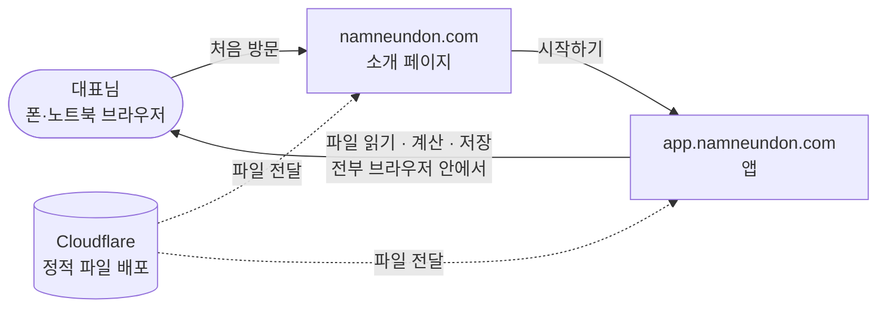

# 남는돈

> **대표님, 이번 달 얼마 남아요?**
> 은행 거래내역 파일을 올리면 사업으로 번 돈 · 쓴 돈 · 순이익과 앞으로의 예상 잔액을 보여주는 웹앱입니다.

|                    | 주소                       |
| ------------------ | -------------------------- |
| 소개 페이지 (랜딩) | https://namneundon.com     |
| 앱                 | https://app.namneundon.com |

## 무엇을 해결하나

작은 가게 대표님은 통장 잔액은 알아도 「이번 달 장사로 얼마 남았는지」는 바로 알기 어렵습니다.
남는돈은 은행에서 내려받은 거래내역을 읽어 잔액을 검산하고, 거래처마다 용도(매출 · 식자재 · 월세 …)를 정하게 한 뒤
달마다 번 돈 · 쓴 돈 · 순이익과 예상 잔액을 보여줍니다.

- **서버가 없습니다.** 파일 읽기 · 계산 · 저장이 전부 사용자 브라우저 안에서 일어납니다.
- **거래내역은 어디로도 보내지 않습니다.** 정한 분류와 자료는 그 브라우저(`localStorage`)에만 남습니다.



## 기술 스택

| 영역   | 쓰는 것                                                                                                           |
| ------ | ----------------------------------------------------------------------------------------------------------------- |
| 앱     | HTML · CSS · 일반 `<script>` JavaScript (빌드 없음, 프레임워크 없음)                                              |
| 파일   | SheetJS(`xlsx.full.min.js`) · PDF.js(`pdf.min.js`) — 저장소에 그대로 들어 있다                                    |
| 배포   | Cloudflare Workers(앱, 정적 자산만) · Cloudflare Pages(랜딩) · `wrangler`                                         |
| 검사   | Playwright(안전망 테스트) · Prettier · ESLint · Stylelint · html-validate · cspell · TypeScript(JSDoc) · gitleaks |
| 자동화 | GitHub Actions — PR 검사 · main 자동 배포 · 의존성 업데이트                                                       |

## 개발 시작

Node.js 24 (`.nvmrc`)와 Git으로 시작합니다. 기본 setup은 Python 분석 환경까지 준비하므로 OS별 준비 사항을 확인하세요. 자세한 것은 [개발 안내](docs/development.md#개발-환경).

```bash
make setup      # 또는 npm run setup — 도구 점검 · 의존성 · 테스트용 크롬 · 분석 환경
make serve      # 또는 npm run serve — http://localhost:4173 에서 앱 띄우기
```

`make` 만 치면 명령 목록이 나옵니다. Windows 처럼 `make` 가 없으면 `npm run …` 을 씁니다.

## 주요 명령

| 명령                  | 하는 일                                                     |
| --------------------- | ----------------------------------------------------------- |
| `npm run setup`       | 처음 한 번 — 개발 환경을 갖춘다 (다시 돌려도 된다)          |
| `npm run doctor`      | 설치 없이 무엇이 빠졌는지만 본다                            |
| `npm run serve`       | 앱을 내 컴퓨터에서 띄운다 (http://localhost:4173)           |
| `npm test`            | 불러오는 순서 검사 + 안전망 테스트                          |
| `npm run lint`        | 모양 · 린트 · CSS · HTML · 철자 · 타입 검사                 |
| `npm run format`      | 코드 모양 자동 정리                                         |
| `npm run test:update` | **일부러** 화면이나 계산을 바꿨을 때만 스냅샷을 새로 찍는다 |

**main 에 합치면 자동으로 운영에 배포됩니다.** main 에 직접 push 하지 않고 PR 로 합칩니다.

## 레포에서 길 찾기

```text
README.md             제품 소개와 시작 방법
AGENTS.md             모든 AI의 공통 작업 규칙
CLAUDE.md             Claude에만 필요한 안내
app/ · landing/       웹앱과 소개 사이트
analysis/             테스트베드 분석 도구와 상세 사용 안내
tests/ · tools/       검사와 개발 도구
docs/
  product.md          현재 제품과 계산·저장 규칙
  architecture.md     현재 코드 구조와 설계 이유
  development.md      환경·협업·테스트·배포
plans/
  TEMPLATE.md         작업 계획을 작성하는 틀
  <작업>.md           진행 중인 작업마다 한 파일
```

- 처음 참여했다면 [제품](docs/product.md) → [구조](docs/architecture.md) → [개발 안내](docs/development.md) 순서로 읽습니다.
- 큰 변경은 [계획 틀](plans/TEMPLATE.md)을 복사해 요구사항·설계·실행 순서·검증을 한 파일에 적습니다. 브랜치마다 자동으로 만드는 것은 아닙니다.
- 작업이 끝나면 현재 지식은 docs에 반영하고 검증·PR 근거를 남긴 뒤 계획을 삭제합니다. 이전 계획은 Git 이력에서 찾습니다.
- 고객 요청·버그·운영·로드맵은 Linear에서 관리합니다. 사업 자료는 저장소 밖 Google Drive에 있습니다.
- AI는 [AGENTS.md](AGENTS.md)를 먼저 읽고, 분석 작업은 [analysis/README.md](analysis/README.md)를 함께 읽습니다.
