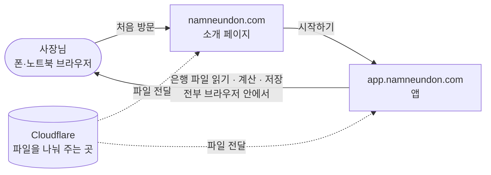
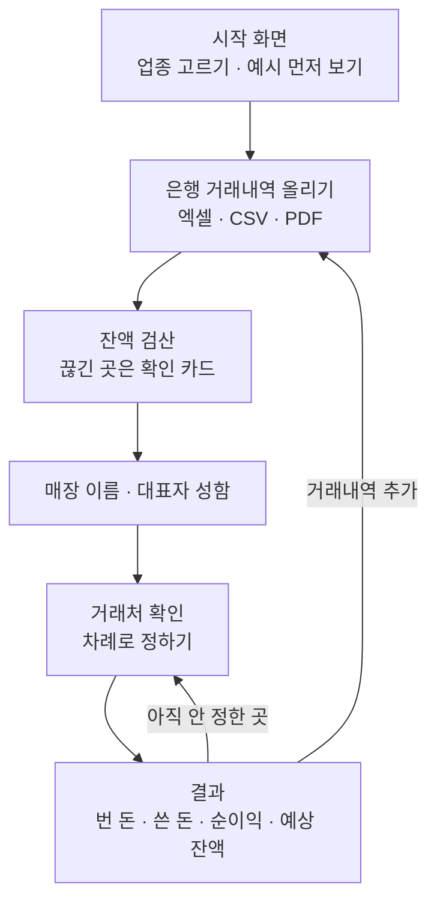
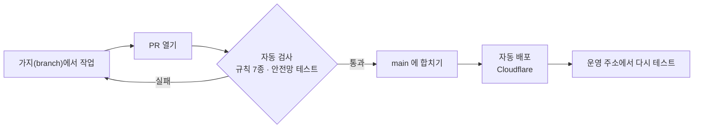

# 남는돈

> **대표님, 이번 달 얼마 남아요?**
> 은행 거래내역 파일을 올리면 사업으로 번 돈 · 쓴 돈 · 남은 돈과 앞으로의 예상 잔액을 보여주는 웹앱입니다.

|                    | 주소                       |
| ------------------ | -------------------------- |
| 소개 페이지 (랜딩) | https://namneundon.com     |
| 앱                 | https://app.namneundon.com |

---

## 한눈에 보기

### 서비스는 이렇게 돌아간다



- **서버가 없습니다.** 앱은 파일(HTML · CSS · JavaScript)일 뿐이고, 계산은 사장님 브라우저 안에서 합니다.
- **거래내역은 어디로도 보내지 않습니다.** 분류한 내용은 그 브라우저에만 저장됩니다 (`localStorage`).

### 사장님이 쓰는 순서



### 코드가 운영에 올라가는 길



**main 에 합치면 몇 분 안에 운영에 반영됩니다.** 사람이 따로 올리지 않습니다.

---

## 폴더 지도

| 폴더 · 파일               | 무엇                                              | 누가 보나     |
| ------------------------- | ------------------------------------------------- | ------------- |
| `app/`                    | **앱** — 사장님이 쓰는 화면과 계산 전부           | 개발          |
| `landing/`                | **소개 페이지** — namneundon.com                  | 개발 · 마케팅 |
| `tests/`                  | 자동 검사 — 화면 글자·계산 숫자가 바뀌지 않았는지 | 개발          |
| `tools/`                  | 개발 도구 (불러오는 순서 검사 등)                 | 개발          |
| `docs/`                   | 문서 (아래 목록)                                  | 모두          |
| `.github/`                | 자동화 — 검사 · 배포 · 의존성 업데이트            | 개발          |
| `wrangler.jsonc`          | 앱 배포 설정 (Cloudflare)                         | 개발          |
| `AGENTS.md` · `CLAUDE.md` | AI(Claude · Codex 등)에게 주는 작업 규칙          | AI            |

### 문서

| 문서                                         | 무엇                                   | 누구를 위한 |
| -------------------------------------------- | -------------------------------------- | ----------- |
| [docs/roadmap.md](docs/roadmap.md)           | 할 일 목록과 진행 상황                 | 모두        |
| [docs/deploy.md](docs/deploy.md)             | 배포 구성, 주소, 토큰, 되돌리는 법     | 개발        |
| [docs/structure.md](docs/structure.md)       | `app/src` 파일마다 무엇이 있나         | 개발        |
| [docs/testing.md](docs/testing.md)           | 안전망 테스트 — 무엇을 어떻게 확인하나 | 개발        |
| [docs/code-quality.md](docs/code-quality.md) | 코드 규칙 검사 7종과 기준선            | 개발        |

> 문서는 GitHub 에서 보면 표와 그림이 그려진 상태로 보입니다.
> 내 컴퓨터에서는 VS Code 미리보기(`Cmd+Shift+V`)나 Obsidian 으로 보면 읽기 편합니다.

---

## 개발하기

### 처음 한 번

Node.js 24 가 필요합니다 (`.nvmrc`).

```bash
npm run setup
```

설치 · 테스트용 크롬 · 기본 검사까지 한 번에 합니다.

### 자주 쓰는 명령

| 명령                  | 하는 일                                                      |
| --------------------- | ------------------------------------------------------------ |
| `npm run serve`       | 앱을 내 컴퓨터에서 띄운다 → http://localhost:4173            |
| `npm test`            | 안전망 테스트 (화면 글자·계산 숫자·저장 자료·보안·장부 검산) |
| `npm run lint`        | 코드 규칙 검사 7종                                           |
| `npm run format`      | 코드 모양 자동 정리                                          |
| `npm run test:update` | **일부러** 화면이나 계산을 바꿨을 때 스냅샷 새로 찍기        |

### 작업 규칙

1. **main 에 직접 올리지 않는다.** 가지를 만들고 PR 로 합친다. (비공개 저장소 무료 요금제라 GitHub 가 막아 주지 않는다 — 약속으로 지킨다)
2. **자동 검사가 통과해야 합친다.** 커밋할 때도 바뀐 파일은 자동으로 검사된다.
3. **사장님 저장 자료의 이름·형식을 바꾸지 않는다.** 바꾸면 이미 정해 둔 분류가 사라진다.
4. **실제 은행 파일은 저장소에 넣지 않는다.** 개인정보다. 테스트는 예시 거래로 만든 파일을 쓴다.
5. 토큰 · 비밀번호는 파일에 적지 않는다 (GitHub Secrets 에 둔다).

---

## 관련 자료

- **사업 자료** (계획서 · 데이터 명세서 · 교육 자료 등): Google Drive 공유 폴더. 로컬 사본은 `~/Desktop/google-drive` (저장소 밖)
  ```bash
  rclone sync namneundon: ~/Desktop/google-drive
  ```
- **D-테스트베드** (2026-09-21 ~ 12-11): 금융위 · 한국핀테크지원센터. 할 일은 [roadmap](docs/roadmap.md) 의 E 항목
