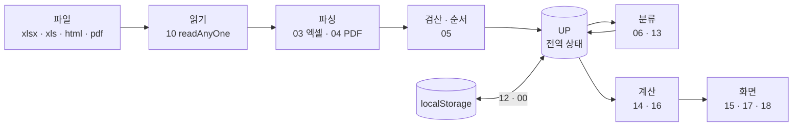
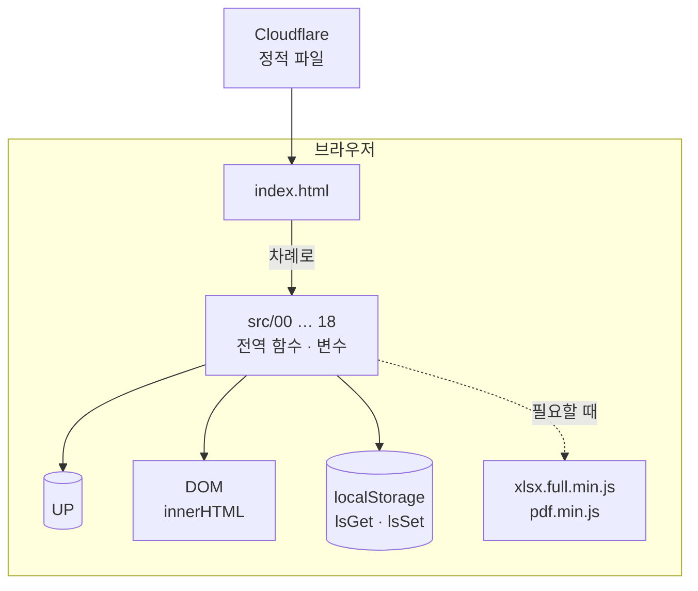

# 아키텍처 — 지금 모습

> **지금 코드의 사실**만 적는다. 앞으로 바꿀 구조(계산 핵심 분리 등)는 여기가 아니라 [backlog](../backlog.md) · [specs/](../../specs/README.md) 에 있다.
> 기준: 2026-09-25 main (`8f62002`).

## 한눈에

- 서버 코드가 없다. `app/` 폴더의 정적 파일(HTML · CSS · JS · 이미지)을 Cloudflare 가 그대로 내준다.
- 빌드 · 번들 · 트랜스파일 단계가 없다. 저장소의 파일이 곧 배포되는 파일이다.
- 앱 JS 는 **모듈이 아닌 일반 `<script>` 19개**다. 한 파일이었던 것을 나눈 것이라 모든 최상위 `function` · `var` 가 전역이다.

## 폴더와 경계

| 폴더 · 파일                   | 무엇                                                                | 어디로 가나                                  |
| ----------------------------- | ------------------------------------------------------------------- | -------------------------------------------- |
| `app/`                        | 앱 전부                                                             | Worker `namneundon-app` → app.namneundon.com |
| `landing/`                    | 소개 페이지 (한 장짜리 HTML · 404 · 이미지 · robots · sitemap)      | Pages `namneundon` → namneundon.com          |
| `tests/`                      | Playwright 안전망 테스트 · 스냅샷 · 테스트용 정적 서버(`serve.mjs`) | 배포 안 됨                                   |
| `tools/`                      | 개발 도구 (`check-load-order.mjs`, `typecheck-app.mjs`)             | 배포 안 됨                                   |
| `.github/`                    | CI · 자동 배포 · 비밀 값 검사 · 의존성 업데이트                     | —                                            |
| `wrangler.jsonc`              | 앱 Worker 설정 (정적 자산만, 서버 코드 없음)                        | —                                            |
| `docs/` `specs/` `templates/` | 문서 · 작업 명세 · 틀                                               | 배포 안 됨                                   |

랜딩과 앱은 코드를 나눠 쓰지 않는다. 랜딩은 「시작하기」 링크(`APP_URL`)로 앱 주소만 안다.

## `app/` 안

```
app/
├─ index.html            뼈대 + CSS · JS 를 차례로 불러온다
├─ css/app.css           화면 모양 전부
├─ src/00-…18-*.js       앱 코드. 번호 순서 = 불러오는 순서
├─ xlsx.full.min.js      엑셀 읽기 (SheetJS) — 필요할 때만 불러온다
├─ pdf.min.js · pdf.worker.min.js   PDF 읽기 (PDF.js) — 필요할 때만
├─ sw.js                 아무것도 캐시하지 않는 서비스 워커 (홈 화면 설치 조건용)
├─ manifest.json · icon-*.png       홈 화면 설치(PWA)
├─ _headers              Cloudflare 캐시 규칙 (index.html · src · css 는 no-store)
└─ robots.txt            검색 노출 차단
```

### `src/` 파일

| 파일                     | 하는 일                                                                       |
| ------------------------ | ----------------------------------------------------------------------------- |
| `00-early.js`            | 첫 화면부터 필요한 함수 (저장소 읽기 · 쓰기 `lsGet/lsSet/lsDel`, 연 날 기록)  |
| `01-biz-demo.js`         | 업종별 문구(`BIZ`), **예시 거래(`DEMO_TX`)** 와 예시 분류                     |
| `02-text-loaders.js`     | 금액 · 조사 표기, 엑셀 · PDF 도구를 필요할 때 불러오기                        |
| `03-parse-excel.js`      | 엑셀 표 → 거래 행 (머리줄 · 열 찾기, 부호 정하기)                             |
| `04-parse-pdf.js`        | PDF → 표                                                                      |
| `05-verify.js`           | 잔액 검산, 순서 바로잡기, 조회 기간                                           |
| `06-classify.js`         | 거래처 이름 다듬기 · 묶기, 자동 분류                                          |
| `07-state-categories.js` | 앱 상태 `UP` 선언, 항목 · 업종 정의                                           |
| `08-ui-start-upload.js`  | 시작 화면, 업로드 창                                                          |
| `09-ui-panel-install.js` | 글씨 크기, 창 열고 닫기, 홈 화면 설치 · 카톡 안내                             |
| `10-demo-read-files.js`  | 예시 시작, 파일 읽기, 은행 알아보기                                           |
| `11-upload-flow.js`      | 파일 목록, 시작하기(`UP` 만들기), 잔액 끊김 확인 카드                         |
| `12-storage.js`          | 저장 · 불러오기, 사용 기록, 직접 넣은 금액                                    |
| `13-onboard.js`          | 매장 이름 · 대표자, 거래처 확인(차례로 정하기)                                |
| `14-compute.js`          | 달마다 계산(`monthNumbers`), 계좌 간 이체, 잔액, 예측 기초                    |
| `15-result-panels.js`    | 결과 보여주기, 항목 관리, 분류 내보내기 · 불러오기, 매장 이름 바꾸기          |
| `16-due.js`              | 예상 잔액 · 예정 지출 계산과 카드 · 그래프                                    |
| `17-result.js`           | 결과 화면 본문(`drawResultInner`), 확인 카드                                  |
| `18-charts-year.js`      | 그래프, 1년 보기. **맨 끝에서 앱을 시작한다** (`startDemo()` → `drawStart()`) |

## 흐름 — 입력에서 화면까지



| 단계 | 코드                                                                                      | 결과                                |
| ---- | ----------------------------------------------------------------------------------------- | ----------------------------------- |
| 입력 | `10-demo-read-files.js` (`readAnyOne` · `readOnePdf`), 라이브러리는 `02` 가 늦게 불러온다 | 파일마다 표                         |
| 파싱 | `03-parse-excel.js` · `04-parse-pdf.js`                                                   | 계좌(`banks`)별 거래 행             |
| 검산 | `05-verify.js`                                                                            | 순서 바로잡은 행, 끊긴 곳(`breaks`) |
| 상태 | `11-upload-flow.js` 가 `UP = {…}` 를 새로 만든다. 예시는 `10` 의 `startDemo`              | `UP.rows` · `UP.banks` 등           |
| 분류 | `06-classify.js` (묶기 · 자동 분류) → `13-onboard.js` (사용자에게 묻기) → `12` 저장       | `UP.payees` · `UP.byName`           |
| 계산 | `14-compute.js` `monthNumbers(m, cutDay)`, `16-due.js` 예상 잔액                          | 달마다 숫자 객체                    |
| 표시 | `15` · `17` (`drawResultInner`) · `18`                                                    | DOM                                 |

계산 규칙 자체는 [domain-rules](../product/domain-rules.md) 에 있다.

## 의존 관계 — 지금 모습의 특징

- **전역 상태 `UP`.** `07` 에서 `var UP = null` 로 선언하고, 파일을 올리거나 예시를 열 때 통째로 새로 만든다. 계산 함수(`monthNumbers` 등)는 인자가 아니라 `UP.rows` · `UP.byName` 을 직접 읽는다. 그래서 계산만 따로 떼어 Node 에서 돌릴 수 없다.
- **DOM 직접 조작.** 화면은 문자열로 HTML 을 만들어 `innerHTML` 에 넣는 방식이 많다. 밖에서 온 글자(파일 이름 등)는 이스케이프해야 한다 — `tests/security.spec.mjs` 가 파일 이름 한 곳을 지킨다.
- **저장소 한 길.** 모든 저장은 `lsGet` · `lsSet` · `lsDel`(`00-early.js`)을 거친다. 동기 호출이라 화면을 그리기 전에 값이 있다. 저장이 막혀도 앱은 메모리로 돈다.
- **불러오는 순서.** 각 파일은 불러오는 순간 일부 코드를 실행한다. 그때 뒤 파일의 이름을 쓰면 `ReferenceError` 다. `tools/check-load-order.mjs` 가 파일마다 「즉시 실행되는 코드」에서 출발해 부르는 함수 안까지 따라가며 찾는다 (클릭 처리 등 나중에 도는 콜백은 따라가지 않는다).
- **서비스 워커**는 요청을 가로채지 않는다 (`respondWith` 없음). 옛 화면이 남는 문제는 HTTP 캐시 쪽이라 `_headers` 로 다룬다.



## 테스트 · 검사 · 배포와의 경계

- 테스트는 `tests/serve.mjs` 가 `app/` 을 그대로 내주고, Playwright 가 실제 크롬으로 연다. 앱 코드는 테스트를 위해 따로 내보내는 것이 없다 — 테스트는 전역 함수(`monthList` · `monthNumbers` 등)를 `page.evaluate` 로 부른다. **그래서 이 전역 이름들은 테스트가 기대는 인터페이스이기도 하다.**
- 타입 검사 · 린트는 `app/src` 를 한 묶음으로 본다 (`tsconfig.app.json`, `eslint.config.mjs` 가 모든 파일의 최상위 이름을 「공용 전역」으로 알려준다).
- 배포는 `app/` 과 `landing/` 을 그대로 올린다 ([deployment](../development/deployment.md)).
