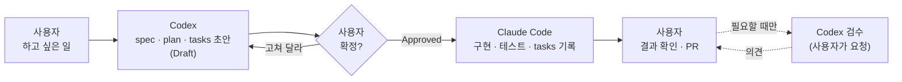

# 작업 절차 — 계획 · 확정 · 구현 · 검증

역할 분담의 결정과 이유는 [결정 0006](../decisions/0006-ai-roles.md). 이 문서는 실제로 일하는 순서다.
**사용자의 그때그때 요청이 이 기본 절차보다 앞선다.**

## 흐름



| 단계 | 누가        | 하는 일                                                                                                                        | 남는 것                         |
| ---- | ----------- | ------------------------------------------------------------------------------------------------------------------------------ | ------------------------------- |
| 1    | 사용자      | 하고 싶은 일 · 배경을 Codex 에 말한다                                                                                          | —                               |
| 2    | Codex       | 저장소를 읽고 명세 · 계획 · 할 일 초안을 쓴다. 조사한 브랜치 · 커밋을 적는다                                                   | `specs/<작업>/` (상태 `Draft`)  |
| 3    | 사용자      | 읽고 고치게 하거나 확정한다. 확정하면 상태를 `Approved` 로 바꾸고 날짜를 적는다 (또는 AI 에게 「Approved 로 바꿔라」라고 지시) | 상태 `Approved`                 |
| 4    | Claude Code | 계획과 코드를 대조하고 구현 · 테스트 · 기록한다                                                                                | 코드 · 테스트 · `tasks.md` 기록 |
| 5    | 사용자      | 결과를 확인하고 PR 을 합친다. 필요하면 검수를 요청한다                                                                         | PR · 명세 상태 `Completed`      |

## 명세를 쓸까 말까

| 쓴다 (`specs/`)                                           | 안 쓴다 (바로 작업)                                |
| --------------------------------------------------------- | -------------------------------------------------- |
| 새 기능, 화면 흐름 변경                                   | 오타 · 문구 몇 글자                                |
| 계산 · 분류 규칙 변경                                     | 한두 줄 버그 수정 (원인이 분명하고 영향이 좁을 때) |
| 여러 파일에 걸친 리팩토링, 파일 구조 · 불러오는 순서 변경 | 문서 보강, 링크 고치기                             |
| 저장 자료 · 내보내기 형식 등 **호환성**에 닿는 변경       | 의존성 업데이트 (CI 가 통과하면)                   |
| 새 도구 · 빌드 · 외부 서비스 도입                         | 테스트 추가만                                      |

애매하면 작게 시작하고, 작업 중 위 왼쪽에 닿으면 멈추고 명세로 옮긴다. 명세 없이 한 작업도 PR 설명에 무엇을 왜 · 어떻게 확인했는지 적는다.

## 계획이 바뀔 때

- **확정(`Approved`) 뒤에 계획을 바꿔야 하면** 구현자는 멈추고 근거와 대안을 사용자에게 제시한다. 사용자가 정하면 계획을 쓴 쪽(보통 Codex, 사용자 지시가 있으면 Claude)이 `plan.md` 를 고치고 「바뀐 내용」 절에 날짜 · 이유를 남긴다. 상태는 사용자가 다시 확정한다.
- 작은 구현 선택(이름 · 위치 · 사소한 단계)은 구현자가 정하고 `tasks.md` 기록에 한 줄 남긴다. 무엇이 「작은」 것인지는 [CLAUDE.md](../../CLAUDE.md#계획과-코드가-부딪치면).
- 계획이 코드 사실과 틀렸으면(없는 함수, 다른 동작) 구현자가 증거를 적어 보고한다. 계획을 몰래 고쳐 맞추지 않는다.

## 상태 표시

상태 뜻과 누가 바꾸는지는 [specs/README.md](../../specs/README.md#상태) 가 원본이다. 요약: `Draft → Approved → Implementing → Completed` (그 밖에 `Superseded` · `Dropped`). **`Approved` 는 사용자만 바꾼다.**

## 같은 파일을 동시에 고치지 않는다

- 한 번에 한 AI 가 한 브랜치 · 한 작업 폴더를 맡는다. Codex 가 계획 문서를 고치는 동안 Claude 가 같은 파일을 고치지 않는다 (반대도 같다).
- 두 도구가 동시에 일해야 하면 **폴더를 나눈다**(worktree, [setup](setup.md#worktree)). 같은 폴더에서 브랜치를 바꾸면 미커밋 변경이 섞인다.
- 작업을 시작할 때 `git status` · 브랜치 · 경로를 확인하고, 모르는 변경이 있으면 건드리지 말고 사용자에게 알린다.

## 검수를 요청할 때 범위를 적는다

검수는 사용자가 요청할 때만 한다 ([codex-review](codex-review.md)). 요청에는 다음을 적어 대상이 흔들리지 않게 한다.

```text
저장소: /Users/…/테스트배드   (또는 worktree 경로)
브랜치: feat/…           기준: main (abc1234)
범위: git diff main...feat/… (커밋 abc1234..def5678)
명세: specs/<작업>/spec.md · plan.md
볼 것: 요구사항 충족 · 계산 규칙 · 저장 호환성 · 테스트 누락
```

## 대화와 기록의 경계

| 공유한다 (저장소에 남긴다)                        | 공유하지 않는다                                   |
| ------------------------------------------------- | ------------------------------------------------- |
| 요구사항 · 완료 조건 (`spec.md`)                  | Claude · Codex 의 대화 전문                       |
| 확정된 설계와 이유 (`plan.md`, `docs/decisions/`) | 각 도구의 임시 메모 (`.omc/`, Codex 세션 메모 등) |
| 코드 · 인터페이스 · 테스트 · 재현 방법            | 내부 추론 과정                                    |
| 진행 상태 · 실제 검증 결과 (`tasks.md`)           | 상대 AI 답변의 요약                               |
| 미해결 질문                                       | 사용자가 요청하지 않은 검수 의견                  |

사용자가 한 도구의 결과를 다른 도구에 직접 붙여 넣는 것은 자유다. 자동으로 넘기는 장치는 만들지 않는다.
