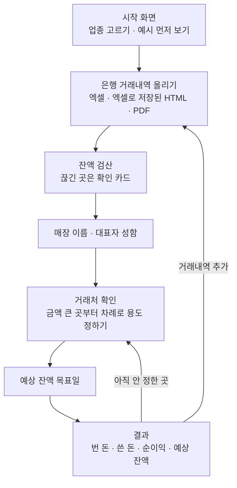

# 제품 개요

> 근거: 앱 코드(`app/`), 화면 글자 스냅샷(`tests/snapshots/`), 기존 README · 문서. 확인되지 않은 것은 맨 아래 「미확정」에 둔다.

## 목적

작은 사업장 대표가 **은행 거래내역 파일만으로** 「이번 달 사업으로 번 돈 · 쓴 돈 · 남은 돈」과 「앞으로의 예상 잔액」을 알게 한다.
시작 화면 문구: 「이번 달 번 돈과 쓴 돈을 확인하세요 — 거래내역을 올리고, 거래처의 용도를 정해주세요」.

제품의 약속 (시작 화면에 그대로 보인다):

- 파일은 서버로 전송되지 않는다. 계산은 이 브라우저 안에서만 이뤄진다.
- 은행에서 받은 거래내역은 이 기기 안에만 남는다.
- 대표님이 분류한 항목 · 적어 둔 예정 지출과 마지막으로 분석한 날짜가 이 브라우저에 남는다.

## 대상 사용자

- 개인 사업장 대표 (앱은 「대표님」이라고 부른다). 시작 화면에서 고르는 업종: **식당 · 카페 · 병원 · 치과 · 약국 · 미용실**.
- 주로 휴대폰으로 쓴다고 보고 만든다 — 테스트 기본 화면 너비가 390px 이고, 홈 화면 설치(PWA) · 카카오톡 안 브라우저 안내 · 글씨 크기 조절이 있다.
- 로그인 · 회원가입은 없다.

## 주요 사용 흐름

| 단계        | 하는 일                                                                                                                                           |
| ----------- | ------------------------------------------------------------------------------------------------------------------------------------------------- |
| 예시 보기   | 파일 없이 예시 거래(`DEMO_TX`, 2,363건)로 결과 화면까지 본다                                                                                      |
| 올리기      | 여러 계좌 · 여러 파일을 한꺼번에. 같은 내용의 파일은 건너뛰고 겹치는 거래를 알아본다(`dupFiles` · `overlapFiles`). 암호 걸린 PDF 는 암호를 묻는다 |
| 검산        | 앞 잔액 ± 금액 = 뒤 잔액이 맞는지 본다. 끊긴 곳은 「확인 카드」로 묻는다                                                                          |
| 거래처 확인 | 거래처를 묶고 용도(매출 · 식자재 · 월세 …)를 정한다. 일부는 앱이 이름으로 자동 분류한다                                                           |
| 결과        | 달마다 · 1년 보기 · 예상 잔액 그래프 · 항목 관리 · 직접 넣기(현금 매출 등) · 분류 내보내기 · 불러오기(JSON)                                       |
| 다시 열기   | 같은 브라우저에서 다시 열면 저장해 둔 분류 · 거래내역으로 이어서 본다                                                                             |

## 하지 않는 것 (현재)

- 서버 저장 · 계정 · 여러 기기 동기화 — 자료는 한 브라우저에만 있다.
- 은행 계좌 연동(오픈뱅킹 등) — 사용자가 파일을 직접 내려받아 올린다.
- 세금 계산 · 신고.

## 운영 맥락

- **D-테스트베드** (2026-09-21 ~ 12-11, 금융위 · 한국핀테크지원센터) 참가 중이다. 관련 할 일은 [backlog.md](../backlog.md) 의 E 항목.
- 사업 자료(계획서 · 데이터 명세서 · 교육 자료)는 저장소 밖 Google Drive 에 있다.

## 미확정

- **CSV 지원 여부.** 예전 README 는 「엑셀 · CSV · PDF」라고 적었지만, 파일 고르기(`app/index.html` 의 `#upinput`)의 `accept` 는 `.xlsx,.xls,.html,.htm,.pdf` 이고 코드에서 CSV 전용 처리를 찾지 못했다. 지원하는지, 지원해야 하는지 사용자 확인이 필요하다.
- 업종 6개 밖의 사업장(법인, 여러 매장 운영 등)을 대상으로 할지.
- 테스트베드 이후의 제품 방향(서버 동기화 여부 등). `backlog.md` B-2 는 저장소 계층을 「나중에 서버 동기화로 바꿀 자리」로 적었지만 정해진 것은 아니다.
