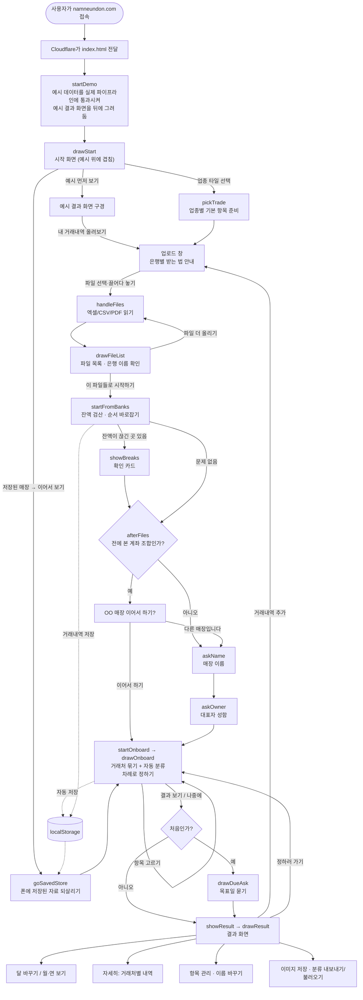
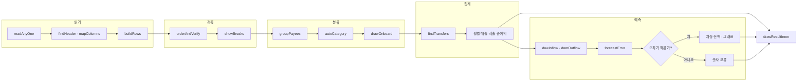

# 남는돈 사용자 흐름 (main · 113차 기준)

## ① 전체 여정

```mermaid
flowchart TD
    Open(["사용자가 namneundon.com 접속"]) --> Load["Cloudflare가 index.html 전달"]
    Load --> Demo["startDemo<br/>예시 데이터를 실제 파이프라인에 통과시켜<br/>예시 결과 화면을 뒤에 그려 둠"]
    Demo --> Start["drawStart<br/>시작 화면 (예시 위에 겹침)"]

    Start -->|"예시 먼저 보기"| DemoView["예시 결과 화면 구경"]
    DemoView -->|"내 거래내역 올려보기"| Upload
    Start -->|"업종 타일 선택"| Trade["pickTrade<br/>업종별 기본 항목 준비"]
    Trade --> Upload["업로드 창<br/>은행별 받는 법 안내"]
    Start -->|"저장된 매장 → 이어서 보기"| Restore["goSavedStore<br/>폰에 저장된 자료 되살리기"]
    Restore --> Onboard

    Upload -->|"파일 선택·끌어다 놓기"| Read["handleFiles<br/>엑셀/CSV/PDF 읽기"]
    Read --> List["drawFileList<br/>파일 목록 · 은행 이름 확인"]
    List -->|"파일 더 올리기"| Read
    List -->|"이 파일들로 시작하기"| Verify["startFromBanks<br/>잔액 검산 · 순서 바로잡기"]

    Verify -->|"잔액이 끊긴 곳 있음"| Breaks["showBreaks<br/>확인 카드"]
    Breaks --> After
    Verify -->|"문제 없음"| After{"afterFiles<br/>전에 본 계좌 조합인가?"}

    After -->|"예"| Known["OO 매장 이어서 하기?"]
    After -->|"아니오"| Name["askName<br/>매장 이름"]
    Known -->|"이어서 하기"| Onboard
    Known -->|"다른 매장입니다"| Name
    Name --> Owner["askOwner<br/>대표자 성함"]
    Owner --> Onboard["startOnboard → drawOnboard<br/>거래처 묶기 + 자동 분류<br/>차례로 정하기"]

    Onboard -->|"항목 고르기"| Onboard
    Onboard -->|"결과 보기 / 나중에"| Due{"처음인가?"}
    Due -->|"예"| DueAsk["drawDueAsk<br/>목표일 묻기"]
    Due -->|"아니오"| Result
    DueAsk --> Result["showResult → drawResult<br/>결과 화면"]

    Result --> R1["달 바꾸기 / 월·연 보기"]
    Result --> R2["자세히: 거래처별 내역"]
    Result --> R3["항목 관리 · 이름 바꾸기"]
    Result --> R4["이미지 저장 · 분류 내보내기/불러오기"]
    Result -->|"거래내역 추가"| Upload
    Result -->|"정하러 가기"| Onboard

    Onboard -.->|"자동 저장"| LS[("localStorage")]
    Verify -.->|"거래내역 저장"| LS
    LS -.-> Restore
```

## ② 결과 숫자가 나오기까지

```mermaid
flowchart LR
    subgraph 읽기
        A1["readAnyOne"] --> A2["findHeader · mapColumns"] --> A3["buildRows"]
    end
    subgraph 검증
        B1["orderAndVerify"] --> B2["showBreaks"]
    end
    subgraph 분류
        C1["groupPayees"] --> C2["autoCategory"] --> C3["drawOnboard"]
    end
    subgraph 집계
        D1["findTransfers"] --> D2["월별 매출·지출·순이익"]
    end
    subgraph 예측
        E1["dowInflow · domOutflow"] --> E2["forecastError"] --> E3{"오차가 작은가?"}
        E3 -->|"예"| E4["예상 잔액 · 그래프"]
        E3 -->|"아니오"| E5["숫자 보류"]
    end
    A3 --> B1
    B2 --> C1
    C3 --> D1
    D2 --> E1
    D2 --> F["drawResultInner"]
    E4 --> F
    E5 --> F
```
