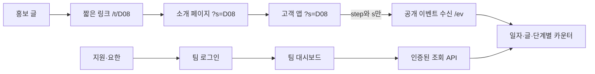

# 유입·사용 현황 — 홍보에서 실제 사용까지 팀이 확인하기

| 항목        | 내용                                                                                                                                                                                                                                                          |
| ----------- | ------------------------------------------------------------------------------------------------------------------------------------------------------------------------------------------------------------------------------------------------------------- |
| 상태        | Implementing — 로컬 구현·검증 완료, 운영 연결·배포 전 (아래 「구현 기록」)                                                                                                                                                                                    |
| 관련 이슈   | [NAM-20](https://linear.app/namneundon/issue/NAM-20), [NAM-21](https://linear.app/namneundon/issue/NAM-21), [NAM-22](https://linear.app/namneundon/issue/NAM-22). 대시보드 이슈는 미등록                                                                      |
| 기준 코드   | 원격 main `3baf3f6ca47711a819bfa8310f847a70d99236b4` (2026-09-29 원격 조회 확인)                                                                                                                                                                              |
| 요청        | 사용자가 세 이슈와 팀 전용 대시보드의 설계를 요청함. 구현·서비스 설정 변경·배포 승인은 아님                                                                                                                                                                   |
| 승인 근거   | 2026-09-29 사용자 채팅 지시 「이 프롬프트로 설계서에 명시된 범위의 구현을 승인한다」. 단 미확인 사실을 확인된 것으로 다루지 않고, 핵심 정책·외부 서비스 설정은 확정하지 않으며, 실제 권한 변경·유료 신청·운영 배포·main 병합·Linear 변경은 하지 않는다는 조건 |
| 작업 브랜치 | `codex/usage-dashboard-design`                                                                                                                                                                                                                                |

## 문제와 원하는 결과

요한과 지원이 기간과 홍보 글을 골라 앱 도착·파일 선택·결과 표시 건수와 비율을 확인한다. 어떤 글이 사용으로 이어지는지, 어느 단계에서 줄어드는지 조사할 근거를 얻는다. 감소 원인을 수치만으로 확정하지 않는다.

고객의 금융 파일은 계속 고객 브라우저에서만 처리한다. 팀 화면에 거래·금액·개인별 행동 기록을 만들지 않는다. 고객 앱은 정적 배포와 기존 계산을 유지하고, 집계·조회 서버와 팀 화면만 별도 경계로 추가한다.

## 범위와 완료 조건

포함: 세 이벤트, 글 코드 전달, 짧은 링크, 처리 안내, 읽기 전용 팀 대시보드, 조회 인증, 집계 품질·오류 표시.
제외: 개인 식별·고유 방문자·재방문 분석, 스레드 조회수/좋아요 API 연동, 광고비/매출/수익률, 개인별 여정, 금융 서버화, 새 예측 계산, 대시보드의 링크 생성·수정 UI, 자동 보고.

- [ ] 시험용 홍보 링크에서 본인 합성 파일 결과까지 진행하면 해당 글 코드의 세 이벤트가 집계된다. — 로컬 시험 수신처로만 확인. 운영 수신 서버 미연결
- [x] 취소·예시·저장본·오류·재그리기에서 잘못된 결과 이벤트가 발생하지 않는다. (로컬 시험, 2026-09-29)
- [ ] 팀원은 기간과 글별 건수·일별 추이를 확인하고, 미수집 기간과 실제 0건을 구분한다. — 모의 응답으로 화면 확인. 집계 원본 미연결
- [ ] 미인증 사용자는 화면과 조회 API 모두 접근할 수 없고 우회 주소도 보호된다. — Worker 코드 시험만. Access 설정·운영 우회 주소 미확인
- [x] 고객 요청 본문에는 step과 선택적 s만 포함된다. 금융 자료·파일명·방문자 ID가 없다. (로컬 시험, 2026-09-29)
- [ ] 안내가 실제 통신·로그·보관 설정과 일치한다. 집계 장애가 고객의 분석을 막지 않는다. — 장애 무관은 로컬 확인. 보관·로그·문의처 미확정이라 안내는 설정이 채워질 때만 보인다
- [x] 앱 저장 키·형식·계산·기존 공유·예시 흐름이 유지된다. (로컬 시험, 2026-09-29)

## 확인한 사실과 미확인 경계

- `landing/index.html:261`의 APP_URL은 앱 도메인이다. 566행은 링크를 새 탭으로 연다. 소개 사이트와 앱은 다른 origin이므로 sessionStorage가 공유되지 않는다.
- `app/src/08-ui-start-upload.js:197`의 drawStart는 시작 화면을 만든다. 재진입할 수 있어 호출마다 도착을 세면 안 된다.
- `app/src/11-upload-flow.js:1`의 handleFiles는 파일 읽기 시작점이다. 파일 개수 0 처리와 선택·드롭 경로를 구현 시 함께 조사한다.
- `app/src/17-result.js:1`의 drawResult는 결과 재그리기에도 쓰인다. drawResultInner 후 markLastRun을 호출한다. 결과 이벤트는 여기의 무조건 호출로 구현하지 않는다.
- `app/src/12-storage.js:391` 이후 useRead/useWrite는 별도의 로컬 사용 기록을 다룬다. 업로드 기간·실패 이유 등 추가 정보가 있으므로 그 객체를 네트워크로 보내거나 재활용하지 않는다.
- Linear 작성자는 worker_v27.js와 33개 시험 완료, POST /ev와 GET /funnel을 보고했다. 이번 설계에서는 서버 원본·배포·응답 구조·보관 400일을 직접 확인하지 못했다. 로컬 Google Drive 사본에서 해당 파일을 찾지 못했다.
- 서버의 누적 집계만으로 과거 날짜별 데이터를 복원할 수 없다. 필요한 집계가 없다면 신규 수집 시작일부터 표시한다.

## 화면 설계

제안 주소는 `team.namneundon.com`이다. 아직 생성하지 않았고 도메인 확정이 필요하다. 기본 화면은 한 페이지, 별도 메뉴·프레임워크·빌드 도입 없이 HTML/CSS/JS로 만든다.

```text
남는돈 · 유입·사용 현황              [로그아웃]
[최근 7일 / 30일 / 날짜 선택] [전체 글 ▼] [새로고침]
한국 시간 · 집계 시작일 · 마지막 조회 시각 · 오늘은 집계 중

[앱 도착 100건] → [파일 선택 30건] → [결과 표시 24건]
파일 선택/도착 30% · 결과/파일 선택 80% · 결과/도착 24%
※ 사용자 수가 아닌 단계별 발생 건수 기준 (위 수치는 예시)

[날짜별 도착·결과 표시 추이 / 동일 데이터의 표]

글 코드 | 제목·원문 링크 | 도착 | 파일 선택 | 결과 | 결과/도착
D08     | ...             | ...  | ...       | ...  | ...
출처 미확인              | ...  | ...       | ...  | ...

측정 기준 · 알려진 누락 가능성 · 집계 시작일
```

- 기본 최근 7일은 오늘 포함 서울 날짜 7개. 오늘은 진행 중임을 표시. 날짜 범위는 시작·끝 날짜를 모두 포함, 최대 90일. 일별 막대/선 차트 아래 접근 가능한 표를 제공한다.
- 글 표 기본 정렬은 결과 건수 내림차순. 원문 링크는 운영 메타데이터이며 고객 이벤트에서 받지 않는다. 낮은 표본에 자동 승자·원인 판정을 붙이지 않는다.
- 분모 0은 비율 `—`. 누락·날짜 경계 때문에 100%를 넘는 경우 원래 값과 주의 표시를 보여주며 강제로 100%로 맞추지 않는다.
- 필터가 바뀌면 이전 요청의 늦은 응답이 새 결과를 덮지 않는다. 로딩·0건·오류·권한 만료를 별개 표시한다. 실패를 0건으로 바꾸지 않는다.
- 조회 실패 시 기존 자료를 남길 경우 이전 조회 시각과 갱신 실패를 표시한다. 정기 자동 새로고침은 첫 버전에서 제외한다.

## 측정 규칙 제안

### 집계 단위와 글 귀속

한 방문의 구현상 단위는 같은 앱 탭의 sessionStorage 수명이다. 이를 고유 사용자나 정확한 세션 분석이라고 부르지 않는다. 중복 탭에서 저장소가 복제되는 브라우저 동작, 저장 차단, 재방문, 광고 차단, 전송 누락을 한계로 명시한다.

- s는 대소문자를 보존하는 영숫자·밑줄 1~12자. 중복 s 파라미터·잘못된 값은 무효 처리한다. 코드 없음은 출처 미확인이다. 유효하지만 목록에 없는 코드는 미등록 코드로 보인다.
- 앱 탭 첫 진입 때 귀속 코드를 고정한다. 같은 탭의 새로고침·다른 s로 재진입에서는 최초 코드를 유지한다. 새 탭에서 별도 진입하면 별도 방문이 될 수 있다. 후속 글 방문이 기록되지 않을 수 있다는 측정 절충을 요한에게 설명한다.
- 소개 페이지는 s를 검증·탭에 보관하고 기존 APP_URL 링크에 전달한다. sessionStorage를 공유한다고 가정하지 않는다. 앱은 받자마자 보관 후 주소의 s만 제거하고 다른 쿼리·해시를 유지한다.
- 새 sessionStorage 키 `nd.analytics.v1`을 제안한다. 담을 값은 버전·귀속 코드·단계별 전송 시도 여부뿐. 방문자 번호·금융 값 없음. 기존 localStorage 키는 바꾸지 않는다.
- 저장소 예외는 메모리로 대체하며 이때 새로고침 중복 방지 한계가 생긴다. 데이터를 분석 서버로 더 보내 보완하지 않는다.

### 이벤트 발생 조건

| step     | 발생 지점과 조건                                              | 제외                                             |
| -------- | ------------------------------------------------------------- | ------------------------------------------------ |
| 도착     | 처리 안내를 포함한 앱 첫 화면이 표시된 후                     | 랜딩만 방문, 화면 재진입                         |
| 파일선택 | 사용자가 1개 이상 파일을 선택하거나 드롭한 직후               | 취소, 빈 목록, 프로그램상 예시/복원              |
| 결과표시 | 새 파일로 만든 분석 상태가 유효한 결과 DOM으로 처음 표시된 후 | 예시, 저장본만 열기, 읽기 실패, 이전 결과 재표시 |

결과의 새 파일 출처를 메모리에 명시적으로 표시한다. 단순히 UP.demo가 false라는 이유로 보내지 않는다. 파일 선택 시작→유효 새 자료 확정→그 자료 결과 표시를 연결한다. 실패한 새 업로드 뒤 옛 화면을 그리는 경우는 제외하고, 유효 파일과 실패 파일이 섞이면 실제 표시 가능한 새 결과가 만들어진 경우에만 포함한다. 저장된 매장에 새 파일을 추가해 결과를 갱신한 경우는 포함한다.

한 탭에서 각 단계는 한 번 전송을 시도한다. 시도 플래그를 요청 전에 세워 동시 호출을 막는다. 클라이언트 자동 재시도·오프라인 큐는 두지 않는다. 수신 여부를 모르는 실패를 재시도하면 ID 없는 계약에서 중복을 막기 어렵기 때문이다. 누락을 허용하는 운영 지표이며 회계·청구 지표가 아니다. 통신 실패 후에도 앱은 계속 사용한다.

이벤트 발생 시점의 서울 날짜에 센다. 자정을 넘는 사용은 서로 다른 날짜에 단계가 찍힐 수 있으므로 표의 비율은 같은 사람 집단의 전환율이 아니다.

## 코드와 서비스 경계



제안 파일 경계(아직 구현되지 않음):

- `app/src/usage-events.js`: 독립 IIFE와 작은 전역 창구. UP/파일/로컬 사용 기록 객체를 받지 않고 허용된 이벤트명만 받는다. 기존 스크립트 상대 순서는 유지하고 초기화 전에 명시적으로 삽입한다. 전역·로드 순서 검사도 반영한다.
- `landing/index.html`: 앱 링크의 s 전달. `app/index.html`, 시작 화면: 안내 및 초기화. `11-upload-flow.js`, `17-result.js`: 출처가 확인되는 최소 연결 지점. 계산 core는 수정하지 않는다.
- `team-dashboard/`: 정적 화면·스타일·조회 코드·측정 설명. 고객 app 배포 폴더에 넣지 않는다.
- `services/usage-dashboard/`: 인증된 조회 API, 기존 수집 서버 어댑터, 별도 배포 설정. 기존 poster 서버의 소스 원본 위치·소유권은 확인 후 연결한다. 소스 사본 두 개를 독립 운영하지 않는다.
- 짧은 링크는 기존 도메인에서 `/t/*`만 담당하는 Worker 경로 또는 현 배포 방식에 맞는 한 가지 라우팅으로 처리한다. 먼저 기존 라우팅 설정을 확인하고 루트·정적 파일·app 도메인 경로를 바꾸지 않는다.

NAM-20 기존 서버를 우선 재사용한다. 새 저장소를 바로 도입하지 않는다. 기존 저장 방식이 일자별 조회·동시 증가를 지원하지 않으면 서버 변경안과 이관 범위를 먼저 확정한다. 과거 누적 수치를 특정 날짜로 배분하지 않는다.

## API·저장 계약

### 공개 수신 (기존 계약 유지)

`POST /ev`, JSON 예: `{"step":"도착","s":"D08"}`. s가 없으면 생략한다. 앱 요청은 credentials omit, referrerPolicy no-referrer, keepalive true를 사용하고 await로 사용자 흐름을 막지 않는다. JSON의 CORS preflight가 배포 앱 origin에서 성공하는지 확인한다.

서버는 단계 열거형·s 규칙·허용 키만 검증하고 불필요 필드가 있으면 거절한다. 기존 300자 제한을 유지하고 UTF-8 바이트 상한도 별도로 방어한다. 본문·전체 URL·금융 정보가 오류 로그에 남지 않게 한다. localhost와 시험 환경은 별도 시험 수신처를 사용하고 운영 집계에 섞지 않는다.

CORS는 인증이 아니다. 공개 수신은 위조·봇 요청을 완전히 차단할 수 없다. 일시적 요청 제한·등록 코드 수 관리·잘못된 코드 제한을 두되 IP 기반 개인 추적 자료를 대시보드에 저장하지 않는다. 기존 서버의 운영·보안 로그 정책은 별도 확인한다.

### 정규화한 조회 계약 (신규 제안)

팀 화면은 같은 origin의 `GET /api/usage?from=YYYY-MM-DD&to=YYYY-MM-DD&s=D08`만 호출한다. s 생략은 전체, 출처 미확인 필터는 별도 명시 값으로 처리하여 실제 s와 충돌하지 않게 한다. 요청 날짜와 최대 기간을 서버에서도 검증한다.

응답 필드:

- `timezone`: Asia/Seoul, `measurementVersion`: 1.
- `trackingStartedAt`, `availableFrom`, `availableTo`, `generatedAt`: 수집 범위와 조회 시점. 실제 최신 이벤트 시각을 알 수 없으면 별도 값을 지어내지 않는다.
- `totals`: arrival, fileSelected, resultShown.
- `daily[]`: date와 세 건수.
- `campaigns[]`: code(출처 미확인은 null), title, postUrl, publishedAt(미확인은 null), 세 건수.
- `warnings[]`: 부분 기간, 집계 진행 중, 알려진 데이터 가용성 제한. SQL·토큰·내부 스택을 반환하지 않는다.

합계·일별·글별 데이터는 같은 범위와 필터에서 일치해야 한다. 데이터 수집 전 날짜는 0으로 꾸미지 않고 미수집 표시한다. 링크는 등록된 https 주소만 허용하고 화면에서 안전하게 렌더링한다.

논리 저장 형태: `(서울 날짜, 글 코드 또는 미확인, step) → 건수`. 수신 시 서버 시간이 기준이며 클라이언트 timestamp를 받지 않는다. 카운터 증가는 동시 요청에서 원자적으로 처리한다. 비원자적인 읽기→증가→쓰기만으로 구현하지 않는다.

메타데이터 `(code, title, postUrl, publishedAt, destination)`는 운영자가 관리하는 서버 설정에서 가져온다. 고객이 보낸 제목·주소를 신뢰하지 않는다. 날짜별 카운터 400일 보관은 기존 기록의 제안값이며 실제 만료 정책 확인 후 안내와 일치시킨다. 정책 변경 전까지 400일을 확인된 사실로 표시하지 않는다.

### 인증과 접근

Cloudflare Access로 팀 화면과 조회 API를 함께 보호하는 안을 추천한다. 두 팀원의 허용 계정은 설정 시 사용자에게 확인하며 여기서 이메일을 추정하지 않는다. 고객의 공개 /ev 및 /t/*에 팀 로그인을 요구하지 않는다.

Access의 인증 설정·권한·요금 적합성은 계정에서 구현 전 확인한다. 사용 방식에 맞는 토큰 검증/관리형 검증을 적용하고 직접 workers.dev·미리보기 주소를 통한 우회를 차단 또는 동일 보호한다. 인증 헤더의 존재만으로 허용하지 않는다. 조회 응답은 private, no-store로 처리하고 브라우저 영구 저장·공유 캐시에 남기지 않는다.

RUN_KEY는 서버 Secret에만 둔다. 브라우저 번들·URL·localStorage에 넣지 않는다. 기존 /funnel이 query key만 받는다면 내부 호출에서도 로그 유출 위험을 점검하고 서버 간 인증 헤더 방식으로 바꾸거나 service binding을 사용한다. 이 계약이 확정되기 전 운영 연결은 막는다. 인증 거부·만료·허용되지 않은 계정·직접 API 접근을 시험한다.

공식 참고: [Workers와 Access](https://developers.cloudflare.com/workers/configuration/cloudflare-access/), [토큰 검증](https://developers.cloudflare.com/cloudflare-one/access-controls/applications/http-apps/authorization-cookie/validating-json/). 고객 이벤트 식별자를 만들지 않는 원칙과 팀 로그인용 인증 쿠키는 구분한다.

## 짧은 링크 (NAM-22)

`https://namneundon.com/t/D08` → 사전에 허용한 소개 페이지의 `?s=D08`로 302 이동하는 안이다. 목적지를 운영 중 변경할 수 있으므로 영구 이동으로 고정하지 않는다. 캐시는 변경 반영을 방해하지 않게 no-store로 한다.

글 코드별 등록 목적지만 사용하고 요청의 redirect/url 값을 목적지로 삼지 않는다. 미등록·잘못된 코드는 404와 정상 홈 링크를 제공한다. 임의 외부 주소 이동을 허용하지 않는다. 기존 링크는 계속 작동하고 루트·기존 정적 경로는 바뀌지 않아야 한다. 링크 클릭 자체는 이번 세 이벤트에 추가하지 않는다.

## 사용자 안내 (NAM-21)

첫 화면과 파일 선택 주변에 아래 초안을 표시한다. 상세 화면에는 전송 항목, 비전송 항목, 탭 내 저장, 보관 기간, Cloudflare와 접속 기록, 문의처를 적는다.

> 거래내역 파일과 분석 결과 금액은 서버로 전송되지 않습니다. 서비스 개선을 위해 이용 단계와 홍보 글 코드를 집계합니다. [데이터 처리 안내]

도착 이벤트는 안내가 DOM에 표시된 뒤 발생한다. 이 순서 자체를 동의 획득으로 해석하지 않는다. 기존 외부 통신·오류 수집을 조사하고 그 결과에 맞춰 필요한 고지·동의 여부를 확정한다. 모든 통신을 확인하기 전 “아무 정보도 보내지 않는다” 또는 “접속 정보도 남지 않는다”고 쓰지 않는다.

## 구현 순서와 인계

1. 지원/Codex: 기존 서버 소스·배포 설정·실제 집계 응답을 읽고 미확인 질문을 닫는다. 최신 main과 기준 SHA의 차이를 재확인한다.
2. 요한: 글 코드·제목·원문 링크 목록, 문의처, 실제 보고 싶은 기간을 제공하고 측정 한계를 확인한다. 지원: 인증·운영 설정과 보관 사실 확인.
3. Claude: 시험 수신처와 서버 어댑터·일별 집계를 먼저 준비하고 계약 테스트를 통과시킨다.
4. Claude: 앱 이벤트·랜딩 전달·처리 안내를 함께 구현한다. NAM-20과 21은 같은 배포 단위.
5. Claude: 팀 화면과 보호된 조회 API를 연결한다. 대시보드 정적 자산·서버는 고객 앱과 별도 배포 설정 사용.
6. Claude: /t/* 라우팅을 추가한다. NAM-22는 20·21의 필수 선행 조건이 아니다. 직접 ?s 링크로 먼저 검증 가능.
7. 지원: PR·운영 설정을 확인하고 배포 판단. 시험 코드로 전 구간 확인 후 운영 안내. 일반 고객 집계 활성화 전 팀 조회 화면도 준비한다.

docs/product.md에는 실제 전송·안내 동작, docs/architecture.md에는 집계·팀 화면 경계, docs/development.md에는 시험·배포·인증·복구 절차를 구현 PR에서 반영한다. 계획의 제안을 현재 제품 동작처럼 미리 적지 않는다.

## 검증 계획

- 순수 테스트: s 경계·중복 파라미터·알 수 없는 키·빈 값·한글/바이트 제한, 날짜·서울 자정·범위 제한, 0 분모, 집계 합계 일치, 동시 증가.
- 브라우저: 랜딩 새 탭 전달, 직접 앱 방문, 새로고침·다른 코드 재진입, 저장 차단, 중복 파일 이벤트, 파일 취소·드롭, 예시→본인 파일, 저장본→신규 추가, 실패 업로드 뒤 옛 결과, 부분 실패, 결과 재그리기.
- 통신 가로채기로 허용 키 외 자료가 없는지 확인. 인위적인 금액·파일명·계좌 문자열이 어떤 요청에도 섞이지 않는지 검사한다. 운영에 시험 이벤트를 보내지 않는다.
- 서버: 미인증·만료·잘못된 권한, 직접 원본/미리보기 주소, 오류 시 비밀 값 노출 없음, 집계 서버 중단, 잘못된 링크·외부 목적지 거부.
- 화면: 로딩·0건·미수집·오류·부분 기간·100% 초과·필터 변경 경쟁, 한국 날짜, 작은 화면/1280px, 키보드 조작·표 대체.
- `npm run lint`, `npm test`와 새 서비스/대시보드의 해당 검사. 기존 루트 검사에 새 폴더가 자동 포함된다고 가정하지 않고 검사 대상을 추가한다. 화면 변경에 필요한 스냅샷만 이유를 기록하며 변경한다.
- 배포 검증: 승인된 시험 코드와 합성 자료로 짧은 링크→소개→앱→결과→팀 화면까지 확인. 시험 데이터는 분리된 저장소/환경으로 운영 수치를 오염시키지 않는다.

## 출시·복구

권장 순서: 서버와 보호된 팀 조회 준비 → 앱 수집·안내 동시 배포 → 짧은 링크 활성화. 서버의 새 계약을 먼저 배포해도 구버전 앱·기존 집계가 깨지지 않게 한다. 날짜별 새 집계 시작일을 표시한다.

기능 플래그로 이벤트 송신을 중단할 수 있게 하고 분석 앱은 그대로 유지한다. 수집을 끌 때 안내도 실제 상태에 맞춘다. 팀 화면 장애는 금융 앱과 독립 복구한다. 링크는 목적지를 기존 정상 소개 페이지로 돌릴 수 있게 한다. 서버 저장 데이터를 자동 삭제하거나 과거 통계를 덮어쓰는 롤백은 하지 않는다.

## 구현 기록 (Claude, 2026-09-29)

기준 대조: 원격 main 은 설계 기준 `3baf3f6` 그대로다. 설계의 파일·함수 위치(landing APP_URL, drawStart, handleFiles, drawResult·markLastRun, useRead/useWrite)가 코드와 맞았다. 이미 구현된 집계·안내·짧은 링크·대시보드는 없었다. 앱·랜딩에 기존 외부 통신 코드(`fetch`·`sendBeacon`·XHR)는 없었다.

`worker_v27.js`: 이 저장소·git 전체 기록·GitHub 계정 저장소 목록·로컬 Google Drive 사본에서 찾지 못했다. 그래서 운영 수신처·조회 원본에 연결하지 않았다. 필요한 것은 아래 「남은 질문」 첫 항목.

바꾼 것:

- 앱: `app/src/03-usage-config.js`(설정, 비어 있음=꺼짐), `04-usage-events.js`(창구 `USAGE`·안내), `00-storage.js`(`ssGet`·`ssSet`, 키 `nd.analytics.v1`), `08`(안내 표시 후 도착), `11`(파일 선택·새 자료 표시), `17`(새 자료 첫 결과), `index.html`(02 뒤에 03·04), `app.css`(안내 모양).
- 랜딩: 올바른 `s` 를 탭에 두고 앱 링크에 붙인다 (`nd.landing.s`).
- `services/`: `usage-rules.js`(검증·서울 날짜·보고서), `access-auth.js`(Access 토큰 RS256 확인, 새 의존성 없음), `campaigns.js`(빈 글 목록), `usage-dashboard/`(Worker·설정, 원본 없으면 503), `short-link/`(Worker·설정).
- `team-dashboard/`: 화면·표시 규칙. `tools/usage-dev.mjs`(`npm run dashboard`, 모의·로컬 시험), `tests/serve.mjs`(경로 바꿔치기·앞단 처리 옵션).
- 검사 대상: ESLint·Stylelint(팀 CSS 경고 0)·html-validate·tsc 에 새 폴더 추가. docs 세 문서 갱신.

구현 중 정한 작은 선택:

- 집계는 설정 세 값(수신 주소·보관 기간·문의처)이 모두 있을 때만 켜진다. 꺼지면 안내의 집계 문장도 없다. localhost 에서 연 앱은 로컬 수신처로만 보낸다.
- 파일 이름은 설계의 `usage-events.js` 대신 번호 규칙에 맞춘 `03-usage-config.js`·`04-usage-events.js`. 설정을 따로 떼어 시험이 그 파일만 바꿔 낼 수 있게 했다.
- 결과 출처 표시는 `UP` 에 필드를 더하지 않고, 새 파일로 만든 `UP` 객체 참조를 창구가 들고 있다가 같은 객체의 첫 결과에서만 센다.
- 짧은 링크는 Worker 로 했다. Pages `_redirects` 는 리디렉트 응답에 `_headers` 가 적용되지 않아 no-store 를 보장할 수 없다(Cloudflare 문서 확인).
- 출처 미확인 필터 값은 `s=-`(코드에 쓸 수 없는 글자). 이벤트 본문 바이트 상한은 600바이트로 두었다(300자 제한과 별도).
- 조회 실패 뒤 이전 숫자는 같은 조건의 새로고침일 때만 남기고 조회 시각을 표시한다. 조건이 바뀐 뒤 실패하면 비운다.

## 남은 질문과 결정

- 필수 확인: worker_v27.js의 관리 원본, 현재 일별 저장·응답·동시 증가·400일 만료, 접속 로그, CORS와 서버 인증 계약.
- 사용자 결정: 별도 집계/대시보드 서버 경계와 team 서브도메인, Access를 사용할 팀 계정 및 실제 사용 가능 플랜. 설계 요청은 서비스 권한 변경 승인으로 기록하지 않는다.
- 제안 확정: 최초 코드 귀속·탭 단위 중복 방지·실패 재전송 없음의 측정 절충, 최근 7일/최대 90일 조회.
- 신규 대시보드 이슈 등록은 별도 수행하지 않았다. 구현 전에 관련 이슈와 이 계획을 연결한다.
- (Claude 구현 뒤) 연결에 필요한 것: `worker_v27.js` 관리 원본과 배포 설정(wrangler 설정·바인딩·저장소 종류), 실제 수신 주소, 서버가 받는 step 값(앱은 `도착`·`파일선택`·`결과표시`), 날짜별 카운터 유무·키 모양·원자적 증가 방식, 만료 설정, `/funnel` 응답 예시와 인증 방식, 허용 CORS origin.
- (Claude 구현 뒤) 사용자 결정: 문의처, 보관 기간 문구, 팀 주소, Access 허용 계정·요금제, 글 코드 목록·시험 코드, 짧은 링크 Worker 경로 연결 시점.

## 검증 기록과 종료

2026-09-29 Codex: 원격 main SHA와 위 파일·함수·Linear 요구사항을 읽음. 서버 원본·운영 권한·집계 실제 동작은 미확인. 이번 산출물은 설계 문서뿐이며 앱·서버 구현 및 배포는 하지 않았다.

2026-09-29 Claude: 위 「구현 기록」대로 구현. 실제 실행한 검증은 아래 표. 운영 배포·연결·Access 설정은 하지 않았다.

| 확인                                      | 결과·한계                                                                                                                                                      |
| ----------------------------------------- | -------------------------------------------------------------------------------------------------------------------------------------------------------------- |
| `npx playwright test tests/usage`         | 41개 통과 — 규칙 9, Worker(인증·조회·짧은 링크) 7, 앱 이벤트·안내·랜딩 12, 대시보드 화면 13                                                                    |
| 결함 주입                                 | 결과 조건·단계 중복 막기를 일부러 지운 사본에서 앱 이벤트 시험 6개가 실패하는 것을 확인하고 원복                                                               |
| `npm run lint`                            | 통과(종료 코드 0). 설계 파일 표 모양 정리·프로젝트 낱말 9개 추가 뒤. CSS 경고 48 기준선 그대로, 팀 대시보드 CSS 경고 0, 앱 타입 오류 0                         |
| `npm test`                                | 145개 통과. 기존 스냅샷 변경 없음 (집계 기본값이 꺼져 있어 화면 그대로)                                                                                        |
| `npm run screens` (origin/main 대비, 2회) | 1회차 104/106 동일·다름 0·흔들림 의심 2(시작 화면 2px 세로줄), 2회차 105/106 동일·다름 0·흔들림 의심 1(다른 자리). 2회차 저장 이미지를 눈으로 비교해 같음 확인 |
| `npm run dashboard` + 브라우저            | 짧은 링크 302→소개(?s)→앱(안내 표시·도착 기록·주소에서 s 제거)→대시보드 숫자 증가, 모르는 코드 404, 허용 외 키 400                                             |
| 미실행                                    | 운영 수신·조회·Access·Workers 배포, 실제 휴대폰, 운영 짧은 링크                                                                                                |

Codex 설계 단계 검사 실행: `npm run lint`는 prettier 미설치로 중단, `npm test`는 acorn 미설치로 로드 순서 검사에서 중단했다. 새 worktree에 node_modules가 없어 전체 검사 통과를 확인하지 못했다. 앱 코드 변경은 없다. 병합·구현·출시 완료를 뜻하지 않는다. 완료 후 현재 규칙은 docs, 시험·병합 근거는 PR/Linear에 남기고 이 계획을 정리한다.
